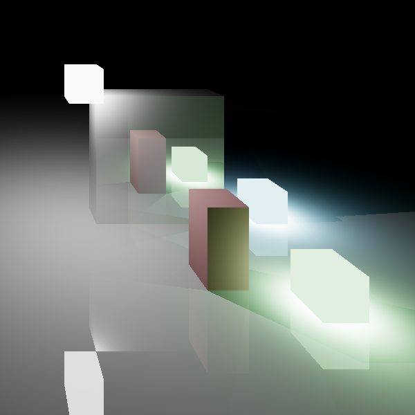

# Voxel Render Engine written in Rust

Implementation of a sparse voxel tree to render a voxel world.
How a camera works has been guesstemated the focus is more on raycasting in an Octree.

## New

We can raytrace throug the voxel tree to the light to generate nice images:  
  
  
The first scene is about 200ms to render multithreaded and the second scene is 22s (i7 8750H).

## old

The resulting image is an depth map like this one:  
  
To render a single image with this tool takes on my i7 8750H on a single thread roughly 130ms and multithreaded roughly 14ms.
Therefore I can conclude that this method is viable for some projects if used multithreaded or for many on a GPU.
